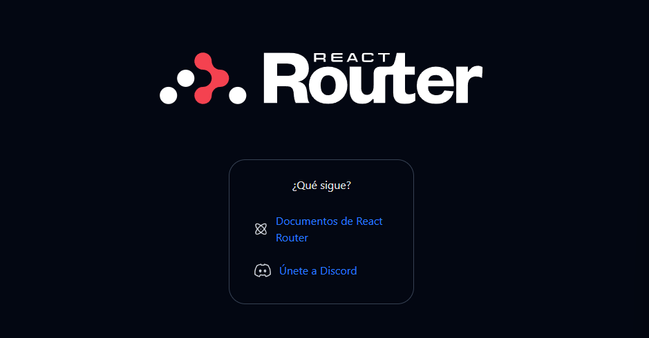

# REACT ROUTER

La mayoría de los proyectos comienzan con una plantilla. Usaremos una plantilla básica mantenida por React Router:

```bash
npx create-react-router@latest my-react-router-app
```

Ahora cambiamos al nuevo directorio e iniciamos la aplicación:

```bash
cd my-react-router-app
npm i
npm run dev
```

Ahora podemos abrir el navegador en la siguiente url: 'http://localhost:5173'

Debe aparecer una página como esta:



# Enrutamiento

## Configuración de rutas

Cada ruta tiene dos partes necesarias

- Un patrón de URL que coincida con la URL.
- Una ruta de archivo al módulo de ruta que define su comportamiento.

Todo esto se hace en el archivo 'app/routes.ts'

> app/routes.ts
```bash
import {
  type RouteConfig,
  route,
} from "@react-router/dev/routes";

export default [
  route("some/path", "./some/file.tsx"),
  // pattern ^           ^ module file
] satisfies RouteConfig;
```


Como yo lo tengo escrito:

> [!NOTE]
>
>```bash
>/*
>Importamos el type de RouteConfig, route desde @react-route/dev/routes
>*/
>import {
>    type RouteConfig,
>    route,
>} from "@react-router/dev/routes"
>
>//export default [index("routes/home.tsx")] satisfies RouteConfig;
>
>export default [
>    route("home", "./routes/home.tsx"),
>    // pattern ^           ^ module file
>  ] satisfies RouteConfig;
>```

> [!NOTE]
> Ejemplo de la página web de ReactRouter
> Ejemplo más grande de configuración de rutas:
> 
> ```bash
> import {
>   type RouteConfig,
>   route,
>   index,
>   layout,
>   prefix,
> } from "@react-router/dev/routes";
> 
> export default [
>   index("./home.tsx"),
>   route("about", "./about.tsx"),
> 
>   layout("./auth/layout.tsx", [
>     route("login", "./auth/login.tsx"),
>     route("register", "./auth/register.tsx"),
>   ]),
> 
>   ...prefix("concerts", [
>     index("./concerts/home.tsx"),
>     route(":city", "./concerts/city.tsx"),
>     route("trending", "./concerts/trending.tsx"),
>   ]),
> ] satisfies RouteConfig;
> ```
