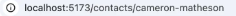
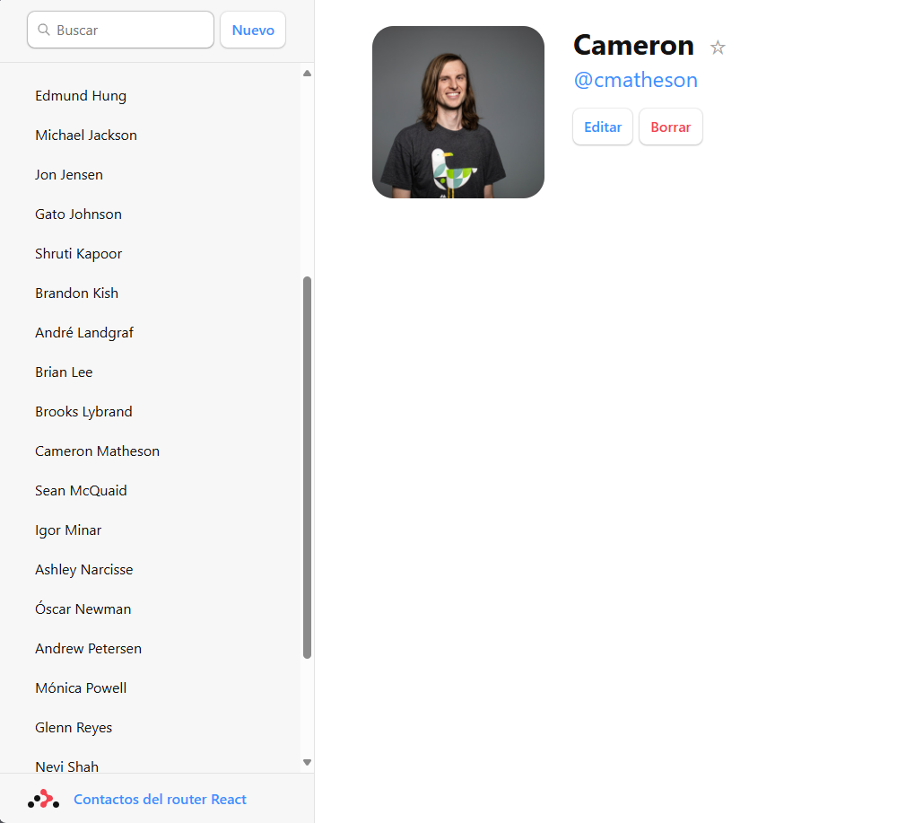
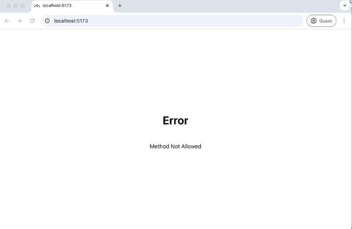
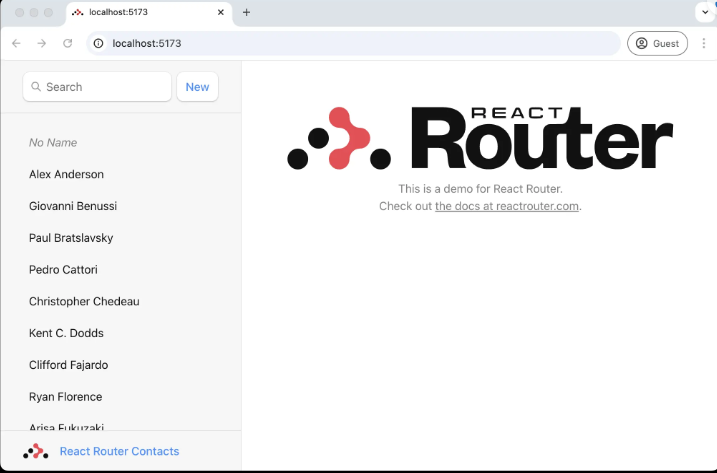
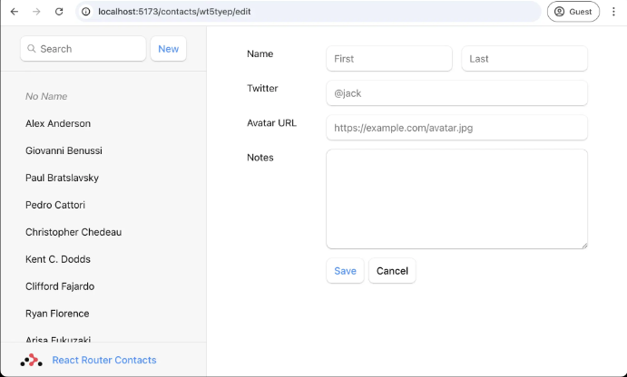

# Libreta de Direcciones

Generamos una plantilla básica:

```bash
npx create-react-router@latest --template remix-run/react-router/tutorials/address-book
```

Esto utiliza una plantilla bastante básica, pero incluye nuestro css y modelo de datos, por lo que podemos centrarnos en React Router.

### Iniciamos la aplicación

```bash
cd /ruta/a/la/app

// Instalamos las dependencias
npm install

// Inicializamos el servidor
npm run dev
```

En la ruta `app/root.tsx` contiene el diseño global de la página, es decir, la interfaz de usuario.

## La interfaz de usuario de la ruta de contacto

Si ahora hacemos clic en alguno de los elementos de la barra lateral, obtendremos la página 404 predeterminada.
Vamos a crear ima ruta que coincida con la url. `/contacts/1`

### 👉 Crear un módulo de ruta de contacto

```bash
mkdir app/routes
touch app/routes/contact.tsx
```

Podríamos poner este archivo en cualquier lugar que queramos, pero para hacer las cosas un poco más organizadas, pondremos todas nuestras rutas dentro del directorio. `app/routes`

### 👉 Configurar la ruta

Necesitamos informar a React Router sobre nuestra nueva ruta, es un fichero especial donde podemos configurar todas nuestras rutas. `routes.ts`

Agregaremos las siguientes líneas que están comentadas (pero la agregamos sin comentar).

```bash
import type { RouteConfig } from "@react-router/dev/routes";
# import { route } from "@react-router/dev/routes";

export default [
#  route("contacts/:contactId", "routes/contact.tsx"),
] satisfies RouteConfig;

```

En React Router, hace que un segmento sea dinámico. Acabamos de hacer que las siguientes URLs coincidan con el módulo de ruta `:routes/contact.tsx`

### 👉 Agregar la interfaz de usuario del componente de contacto

Es solo un montón de elementos, siéntete libre de copiar / pegar.  `app/routes/contact.tsx`

```bash
import { Form } from "react-router";

import type { ContactRecord } from "../data";

export default function Contact() {
  const contact = {
    first: "Your",
    last: "Name",
    avatar: "https://placecats.com/200/200",
    twitter: "your_handle",
    notes: "Some notes",
    favorite: true,
  };

  return (
    <div id="contact">
      <div>
        
      </div>

      <div>
        <h1>
          {contact.first || contact.last ? (
            <>
              {contact.first} {contact.last}
            </>
          ) : (
            <i>No Name</i>
          )}
          <Favorite contact={contact} />
        </h1>

        {contact.twitter ? (
          <p>
            <a
              href={`https://twitter.com/${contact.twitter}`}
            >
              {contact.twitter}
            </a>
          </p>
        ) : null}

        {contact.notes ? <p>{contact.notes}</p> : null}

        <div>
          <Form action="edit">
            <button type="submit">Edit</button>
          </Form>

          <Form
            action="destroy"
            method="post"
            onSubmit={(event) => {
              const response = confirm(
                "Please confirm you want to delete this record."
              );
              if (!response) {
                event.preventDefault();
              }
            }}
          >
            <button type="submit">Delete</button>
          </Form>
        </div>
      </div>
    </div>
  );
}

function Favorite({
  contact,
}: {
  contact: Pick<ContactRecord, "favorite">;
}) {
  const favorite = contact.favorite;

  return (
    <Form method="post">
      <button
        aria-label={
          favorite
            ? "Remove from favorites"
            : "Add to favorites"
        }
        name="favorite"
        value={favorite ? "false" : "true"}
      >
        {favorite ? "★" : "☆"}
      </button>
    </Form>
  );
}

```

## Rutas anidadas y puntos de venta

React Router admite enrutamiento anidado. Para que las rutas hijas se rendericen dentro de los diseños principales, necesitamos renderizar un `_Outlet_` en el padre. Arreglémoslo, abramos y hagamos una toma de corriente en el interior. `app/root.tsx`

### 👉 Renderizar un `_<Outlet />_`

`app/root.tsx`
```bash
 import {
  Form,
  Outlet,
  Scripts,
  ScrollRestoration,
  isRouteErrorResponse,
} from "react-router";

// existing imports & exports

export default function App() {
  return (
    <>
      <div id="sidebar">{/* other elements */}</div>
      <div id="detail">
        <Outlet />
      </div>
    </>
  );
}
```

## Enrutamiento del lado del cliente

Es posible que lo haya notado o no, pero cuenado hacemos clic en los enlaces en la barra de lateral, el navegador está realizando una solicitud de documento completo para la siguiente URL en lugar de enrutamiento del lado del cliente, lo que vuelve a montar completamente nuestra aplicación.

El enrutamiento del lado del cliente permite que nuestra aplicación actualice la URL sin tener que volver a cargar toda la página. En su lugar, la aplicación puede representar inmediatamente una nueva interfaz de usuario. Hagámoslo realidad con `_<Link>_`

### 👉 Cambia la barra lateral `<a href>` `a <Vincular a>`

`app/root.tsx`
```bash
import {
  Form,
  Link,
  Outlet,
  Scripts,
  ScrollRestoration,
  isRouteErrorResponse,
} from "react-router";

// existing imports & exports

export default function App() {
  return (
    <>
      <div id="sidebar">
        {/* other elements */}
        <nav>
          <ul>
            <li>
              <Link to={`/contacts/1`}>Your Name</Link>
            </li>
            <li>
              <Link to={`/contacts/2`}>Your Friend</Link>
            </li>
          </ul>
        </nav>
      </div>
      {/* other elements */}
    </>
  );
}

```

## Carga de datos

En la mayoría de los casos, los segmentos de URL, los diseños y los datos que se acoplan juntos. Ya lo podemos ver en esta aplicación: 

| Segmento de URL         | Componente | Datos                  |
|-------------------------|------------|-------------------------|
| `/`                     | `<App>`     | `Lista de contactos`    |
| `contactos/:contactId`  | `<Contact>` | `Contacto individual`   |

Debido a este acoplamiento natural, React Router tiene convenciones de datos para obtener datos en sus componentes de ruta fácilmente.

Primero crearemos y exportaremos una función `clientLoader` en la ruta raíz y, a continuación rederizamos los datos.

### 👉 Exportar una función clientLoader desde app/root.tsx y renderizar los datos

> [!NOTE]
> El siguiente código tiene un error de tipo, lo corregiremos en la siguiente sección.

`app/root.tsx`
```bash
// existing imports
import { getContacts } from "./data";

// existing exports

export async function clientLoader() {
  const contacts = await getContacts();
  return { contacts };
}

export default function App({ loaderData }) {
  const { contacts } = loaderData;

  return (
    <>
      <div id="sidebar">
        {/* other elements */}
        <nav>
          {contacts.length ? (
            <ul>
              {contacts.map((contact) => (
                <li key={contact.id}>
                  <Link to={`contacts/${contact.id}`}>
                    {contact.first || contact.last ? (
                      <>
                        {contact.first} {contact.last}
                      </>
                    ) : (
                      <i>No Name</i>
                    )}
                    {contact.favorite ? (
                      <span>★</span>
                    ) : null}
                  </Link>
                </li>
              ))}
            </ul>
          ) : (
            <p>
              <i>No contacts</i>
            </p>
          )}
        </nav>
      </div>
      {/* other elements */}
    </>
  );
}
```

## Tipo de seguridad 

Probablemente hayas notado que no asignamos un tipo a la propiedad. Vamos a arreglar eso. `loaderData`

### 👉 Agregue el tipo `ComponentProps` al componente `App`

```bash
// existing imports
import type { Route } from "./+types/root";
// existing imports & exports

export default function App({
  loaderData,
}: Route.ComponentProps) {
  const { contacts } = loaderData;

  // existing code
}

```

Espera, ¿qué? ¡¿De dónde vinieron estos tipos?!

No los definimos, pero de alguna manera ya saben sobre la propiedad que devolvimos de nuestro `.contactsclientLoader`

Esto se debe a que React Router genera tipos para cada ruta en su aplicación para proporcionar seguridad de tipos automática.

## Agregar un `HydrateFallback`

Mencionamos anteriormente que estamos trabajando en una aplicación de una sola página sin renderizado del lado del servidor. Si miras dentro de `react-router.config.ts` verás que esto está configurado con un booleano simple:

`react-router.config.ts`
```bash
import { type Config } from "@react-router/dev/config";

export default {
  ssr: false,
} satisfies Config;
```

### 👉 Adición de una exportación de `HydrateFallback`

Podemos proporcionar una reserva que se mostrará antes de que la aplicación se hidrate (se represente en el cliente por primera vez) con una exportación de `HydrateFallback`.

`app/root.tsx`
```bash
// existing imports & exports

export function HydrateFallback() {
  return (
    <div id="loading-splash">
      <div id="loading-splash-spinner" />
      <p>Loading, please wait...</p>
    </div>
  );
}
```

## Indice de rutas

Cuando cargue la aplicación y aún no esté en ninguna página de contacto, notará una gran página en blanco en el lado derecho de la lista.


Cuando una ruta tiene elementos secundarios y se encuentra en la ruta de acceso de la ruta principal, no tiene nada que representar porque no coinciden los elementos secundarios. Puede pensar en las rutas de índice como la ruta secundaria predeterminada para rellenar ese espacio. `<Outlet>`

### 👉 Creación de una ruta de índice para la ruta raíz

```bash
touch app/routes/home.tsx
```

`app/routes.ts`
```bash
import type { RouteConfig } from "@react-router/dev/routes";
import { index, route } from "@react-router/dev/routes";

export default [
  index("routes/home.tsx"),
  route("contacts/:contactId", "routes/contact.tsx"),
] satisfies RouteConfig;

```

### 👉 Rellene los elementos del componente de índice
Siéntase libre de copiar / pegar, nada especial aquí.

`app/routes/home.tsx`
```bash
export default function Home() {
  return (
    <p id="index-page">
      This is a demo for React Router.
      <br />
      Check out{" "}
      <a href="https://reactrouter.com">
        the docs at reactrouter.com
      </a>
      .
    </p>
  );
}
```

## Adición de la ruta Acerca de

Antes de pasar a trabajar con datos dinámicos con los que el usuario puede interactuar, agreguemos
una página con contenido estático que esperamos que rara vez cambie. Una página acerca de será perfecta para esto.

### 👉 Crear la ruta acerca de

```bash
touch app/routes/about.tsx
```
### 👉 Agregar la interfaz de usuario de la página Acerca de

No hay nada especial aquí, solo copia y pega.

`app/routes/about.tsx`
```bash
import { Link } from "react-router";

export default function About() {
  return (
    <div id="about">
      <Link to="/">← Go to demo</Link>
      <h1>About React Router Contacts</h1>

      <div>
        <p>
          This is a demo application showing off some of the
          powerful features of React Router, including
          dynamic routing, nested routes, loaders, actions,
          and more.
        </p>

        <h2>Features</h2>
        <p>
          Explore the demo to see how React Router handles:
        </p>
        <ul>
          <li>
            Data loading and mutations with loaders and
            actions
          </li>
          <li>
            Nested routing with parent/child relationships
          </li>
          <li>URL-based routing with dynamic segments</li>
          <li>Pending and optimistic UI</li>
        </ul>

        <h2>Learn More</h2>
        <p>
          Check out the official documentation at{" "}
          <a href="https://reactrouter.com">
            reactrouter.com
          </a>{" "}
          to learn more about building great web
          applications with React Router.
        </p>
      </div>
    </div>
  );
}

```

### 👉 Añade un enlace a la página "Acerca de" en la barra lateral

`app/root.tsx`
```bash
export default function App() {
  return (
    <>
      <div id="sidebar">
        <h1>
          <Link to="about">React Router Contacts</Link>
        </h1>
        {/* other elements */}
      </div>
      {/* other elements */}
    </>
  );
}
```
## Rutas de diseño

En realidad, no queremos que la página Acerca de esté anidada dentro del diseño de la barra lateral.
Vamos a mover la barra lateral a un diseño para que podamos evitar renderizarla en la página acerca de. Además,
queremos evitar cargar todos los datos de los contactos en la página acerca de.

### 👉 Crear una ruta de diseño para la barra lateral

Puede nombrar y poner esta ruta de diseño donde desee, pero ponerla dentro de un directorio ayudará a mantener las cosas organizadas 
para nuestra secilla aplicación. `layouts`

```bash
 mkdir app/layouts
 touch app/layouts/sidebar.tsx
 ```

Por ahora solo devuelve un `<Outlet>`

`app/layouts/sidebar`
```bash
import { Outlet } from "react-router";

export default function SidebarLayout() {
  return <Outlet />;
}
```

### 👉 Mover definiciones de ruta debajo del diseño de la barra lateral

Podemos definir una ruta para renderizar automáticamente la barra lateral para todas las rutas coincidentes dentro de ella.
Esto es básicamente lo que era, pero ahora podemos abarcarlo a rutas específicas. `layout` `root`

`app/routes`
```bash
import type { RouteConfig } from "@react-router/dev/routes";
import {
  index,
#  layout,
  route,
} from "@react-router/dev/routes";

export default [
#  layout("layouts/sidebar.tsx", [
    index("routes/home.tsx"),
    route("contacts/:contactId", "routes/contact.tsx"),
#  ]),
  route("about", "routes/about.tsx"),
] satisfies RouteConfig;
```
Los únicos cambios es agregar las lineas que están comentadas.

### 👉 Mover el diseño y la obtención de datos al diseño de la barra lateral

Queremos mover todo lo que hay dentro del componente al diseño de la barra lateral. Debería verse así: `clientLoader` `App`

`app/layouts/sidebar.tsx`
```bash
import { Form, Link, Outlet } from "react-router";
import { getContacts } from "../data";
import type { Route } from "./+types/sidebar";

export async function clientLoader() {
  const contacts = await getContacts();
  return { contacts };
}

export default function SidebarLayout({
  loaderData,
}: Route.ComponentProps) {
  const { contacts } = loaderData;

  return (
    <>
      <div id="sidebar">
        <h1>
          <Link to="about">React Router Contacts</Link>
        </h1>
        <div>
          <Form id="search-form" role="search">
            <input
              aria-label="Search contacts"
              id="q"
              name="q"
              placeholder="Search"
              type="search"
            />
            <div
              aria-hidden
              hidden={true}
              id="search-spinner"
            />
          </Form>
          <Form method="post">
            <button type="submit">New</button>
          </Form>
        </div>
        <nav>
          {contacts.length ? (
            <ul>
              {contacts.map((contact) => (
                <li key={contact.id}>
                  <Link to={`contacts/${contact.id}`}>
                    {contact.first || contact.last ? (
                      <>
                        {contact.first} {contact.last}
                      </>
                    ) : (
                      <i>No Name</i>
                    )}
                    {contact.favorite ? (
                      <span>★</span>
                    ) : null}
                  </Link>
                </li>
              ))}
            </ul>
          ) : (
            <p>
              <i>No contacts</i>
            </p>
          )}
        </nav>
      </div>
      <div id="detail">
        <Outlet />
      </div>
    </>
  );
}
```

Y en el interior, solo debe devolver un `<Outlet>` , y todas las importaciones no utilizadas se pueden eliminar. Asegúrese de que no haya ningún archivo `.app/root.tsx` `App` `clientLoader` `root.tsx`

`app/root.tsx`
```bash
// existing imports and exports

export default function App() {
  return <Outlet />;
}
```

## Renderizado previo de una ruta estática

Si actualiza la página Acerca de, seguirá viendo el control giratorio de carga durante una fracción de segundo antes de que la página se procese en el cliente. Esto realmente no es una buena experiencia, además de que la página es solo información estática, deberíamos poder pre-renderizarla como HTML estático en tiempo de compilación.

### 👉 Renderizar previamente la página Acerca de

Dentro de `app/react-router.config.ts` podemos agregar una matriz de `prerenderizado` a la configuración para decirle a React Router
que pre-renderice ciertas URL en tiempo de compilación. En este caso, solo queremos renderizar previamente la página acerca de. `app/react-router.config.ts`

`app/react-router.config.ts`
```bash
import { type Config } from "@react-router/dev/config";

export default {
  ssr: false,
  prerender: ["/about"],
} satisfies Config;
```

## Renderizado del lado del servidor

React Router es un gran marco para crear aplicaciones de una sola página. Muchas aplicaciones se atienden bien solo mediante la representación del lado del cliente y, tal vez, la representación previa estática de algunas páginas en tiempo de compilación.

Si alguna vez quieres introducir el renderizado del lado del servidor en tu aplicación React Router, es increíblemente fácil (¿Recuerdas el booleano de antes?) `ssr:false`

### 👉 Habilitación de la representación del lado del servidor

`app/react-router.config.ts`
```bash
export default {
  ssr: true,
  prerender: ["/about"],
} satisfies Config;
```

Y ahora... ¿Nada es diferente? ¿Todavía estamos recibiendo nuestro spinner por una fracción de segundo antes de que la página se renderice en el cliente? Además, ¿no estamos usando , por lo que nuestros datos aún se obtienen en el cliente? `clientLoader`

¡Así es! Con React Router, aún puede usar (y ) para realizar la obtención de datos del lado del cliente donde mejor le parezca. React Router le brinda mucha flexibilidad para usar la herramienta adecuada para el trabajo. `clientLoader` `clientAction`

Pasemos a usar el `cargador`, que (lo has adivinado) se utiliza para obtener datos en el servidor.

### 👉 Cambiar al uso `del cargador` para obtener datos
`app/layouts/sidebar.tsx`
```bash
// existing imports

export async function loader() {
  const contacts = await getContacts();
  return { contacts };
}
```

Si lo establece o depende de sus necesidades y las de sus usuarios. Ambas estrategias son perfectamente válidas. Durante el resto de este tutorial, vamos a usar el renderizado del lado del servidor, pero sepa que todas las estrategias de renderizado son ciudadanos de primera clase en React Router. `ssr: true` o `ssr: false`

## Parámetros de URL en cargadores

### 👉 Haga clic en uno de los enlaces de la barra lateral

Deberíamos volver a ver nuestra antigua página de contacto estática, con una diferencia: la URL ahora tiene un ID real para el registro.



¿Recuerdas la parte de la definición de la ruta? Estos segmentos dinámicos coincidirán con los valores dinámicos (cambiantes) en esa posición de la URL. A estos valores en la URL los llamamos "Parámetros de URL" o, simplemente, "parámetros". `:contactId` en `app/routes.ts`

Estos se pasan al cargador con claves que coinciden con el segmento dinámico. Por ejemplo, nuestro segmento tiene un nombre, por lo que el valor se pasará como
`params` `:contactId` `params.contactId`

>[!NOTE]
> El siguiente código tiene errores de tipo, los corregiremos en la siguiente sección

`app/routes/contact.tsx`
```bash
// existing imports
import { getContact } from "../data";
import type { Route } from "./+types/contact";

export async function loader({ params }: Route.LoaderArgs) {
  const contact = await getContact(params.contactId);
  return { contact };
}

export default function Contact({
  loaderData,
}: Route.ComponentProps) {
  const { contact } = loaderData;

  // existing code
}

// existing code
```



## Respuestas de lanzamiento

Te darás cuenta de que el tipo es en función de nuestra seguridad de tipos automática, TypeScript ya sabe que es una cadena, pero no hemos hecho nada para asegurarnos de que sea un identificador válido. Dado que es posible que el contacto no exista, podría devolver, por lo que tenemos errores de tipo. `loaderData.contact` `ContactRecord | null` `params.contactId` `getContact` `null`

Podríamos tener en cuenta la posibilidad de que el contacto no se encuentre en el código del componente, pero lo que hay que hacer es enviar un 404 adecuado. Podemos hacer eso en el loader o cargador y resolver todos nuestros problemas a la vez.

`app/routes/contact.tsx`
```bash
// existing imports

export async function loader({ params }: Route.LoaderArgs) {
  const contact = await getContact(params.contactId);
  if (!contact) {
    throw new Response("Not Found", { status: 404 });
  }
  return { contact };
}

// existing code
```

Ahora, si no se encuentra al usuario, la ejecución del código en esta ruta se detiene y React Router representa la ruta del error en su lugar. Los componentes de React Router solo pueden centrarse en la ruta feliz😁 

## Mutaciones de datos

Crearemos nuestro primer contacto en un segundo, pero primero hablemos de HTML.

React Router emula la navegación de formularios HTML como la primitiva de mutación de datos, que solía ser la única forma antes de la explosión cámbrica de JavaScript. ¡No te dejes engañar por la simplicidad! Los formularios en React Router le brindan las capacidades de UX de las aplicaciones renderizadas por el cliente con la simplicidad del modelo web de la "vieja escuela".

Si bien no son familiares para algunos desarrolladores web, los HTML en realidad causan una navegación en el navegador, al igual que hacer clic en un enlace. La única diferencia está en la solicitud: los enlaces solo pueden cambiar la URL, mientras que también pueden cambiar el método de solicitud (vs.) y el cuerpo de la solicitud (datos del formulario). `form` `GET` `POST`

Sin el enrutamiento del lado del cliente, el navegador serializará los datos automáticamente y los enviará al servidor como el cuerpo (body) de la solicitud para y como `URLSearchParams` para React ROuter hace lo mismo, excepto que en lugar de enviar la solicitud al servidor, utiliza el enrutamiento del lado del cliente y la envía a la función de `action`. `form` `POST` `GET`

Podemos probar esto haciendo clic en el botón "Nuevo" en nuestra aplicación.



React Router envía un 405 porque no hay código en el servidor para manejar este formulario de navegación.

## Creación de contactos

Crearemos nuevos contactos exportando una función en nuestra ruta raíz. Cuando el usuario hace clic en el botón "Nuevo", el formulario pasará a la acción de ruta raíz. `action` `POST`

## 👉 Exportar una función de `action` desde `app/root.tsx`

`app/root.tsx`
```bash
// existing imports

import { createEmptyContact } from "./data";

export async function action() {
  const contact = await createEmptyContact();
  return { contact };
}

// existing code
```


El método simplemente crea un contacto vacío sin nombre ni datos ni nada. Pero aún así crea un récord, ¡lo prometo! `createEmptyContact`

> 🧐 Espera un segundo... ¿Cómo se actualizó la barra lateral? 
> ¿Dónde llamamos a la función? 
> ¿Dónde está el código para volver a recuperar los datos? ¿Dónde están?
> `action` `useState` `onSubmit` `useEffect`

Aquí es donde aparece el modelo de programación de la "web de la vieja escuela". `<Form>` evita que el navegador envíe la solicitud al servidor y la envía a la función de su ruta en su lugar con `fetch`. `action`

En semántica web, generalmente significa que algunos datos están cambiando. Por convención, React Router usa esto como una sugerencia para revalidar automáticamente los datos en la página después de que finalice. `POST` `action`

De hecho, dado que todo es solo HTML y HTTP, puede deshabilitar JavaScript y todo seguirá funcionando. En lugar de que React Router serialice el formulario y realice una solicitud de `fetch` o `recuperación` a su servidor, el navegador serializará el formulario y realizará una solicitud de documento. A partir de ahí, React Router renderizará el lado del servidor de la página y lo enviará. Al final, es la misma interfaz de usuario de cualquier manera.

Sin embargo, mantendremos JavaScript porque vamos a crear una mejor experiencia de usuario que los favicons giratorios y los documentos estáticos.

## Actualización de datos

Agreguemos una forma de completar la información para nuestro nuevo registro.

Al igual que la creación de datos, los actualiza con `<Form>`. Vamos hacer un nuevo módulo de ruta dentro de `app/routes/edit-contact.tsx`

### 👉 Crear la ruta de edición de contacto

```bash
touch app/routes/edit-contact.tsx
```
No olvide agregar la ruta a : `app/routes.ts`

`app/routes.ts`
```bash
export default [
  layout("layouts/sidebar.tsx", [
    index("routes/home.tsx"),
    route("contacts/:contactId", "routes/contact.tsx"),
    route(
      "contacts/:contactId/edit",
      "routes/edit-contact.tsx"
    ),
  ]),
  route("about", "routes/about.tsx"),
] satisfies RouteConfig;
```
### 👉 Agregar la interfaz de usuario de la página de edición

Nada que no hayamos visto antes, siéntete libre de copiar/pegar:

`app/routes/edit-contact.tsx`
```bash
import { Form } from "react-router";
import type { Route } from "./+types/edit-contact";

import { getContact } from "../data";

export async function loader({ params }: Route.LoaderArgs) {
  const contact = await getContact(params.contactId);
  if (!contact) {
    throw new Response("Not Found", { status: 404 });
  }
  return { contact };
}

export default function EditContact({
  loaderData,
}: Route.ComponentProps) {
  const { contact } = loaderData;

  return (
    <Form key={contact.id} id="contact-form" method="post">
      <p>
        <span>Name</span>
        <input
          aria-label="First name"
          defaultValue={contact.first}
          name="first"
          placeholder="First"
          type="text"
        />
        <input
          aria-label="Last name"
          defaultValue={contact.last}
          name="last"
          placeholder="Last"
          type="text"
        />
      </p>
      <label>
        <span>Twitter</span>
        <input
          defaultValue={contact.twitter}
          name="twitter"
          placeholder="@jack"
          type="text"
        />
      </label>
      <label>
        <span>Avatar URL</span>
        <input
          aria-label="Avatar URL"
          defaultValue={contact.avatar}
          name="avatar"
          placeholder="https://example.com/avatar.jpg"
          type="text"
        />
      </label>
      <label>
        <span>Notes</span>
        <textarea
          defaultValue={contact.notes}
          name="notes"
          rows={6}
        />
      </label>
      <p>
        <button type="submit">Save</button>
        <button type="button">Cancel</button>
      </p>
    </Form>
  );
}
```

Ahora haga clic en su nuevo registro, luego haga clic en el botón "Editar". Deberíamos ver la nueva ruta.



## Actualización de contactos con FormData

La ruta de edición que acabamos de crear ya representa un archivo . Todo lo que tenemos que hacer es añadir la función. React Router serializará el , it con `fetch` y revalidará automáticamente todos los datos. `form` `action` `form` `POST`

### 👉 Agregar una función de `action` a la ruta de edición

`app/routes/edit-contact.tsx`
```bash
import { Form, redirect } from "react-router";
// existing imports

import { getContact, updateContact } from "../data";

export async function action({
  params,
  request,
}: Route.ActionArgs) {
  const formData = await request.formData();
  const updates = Object.fromEntries(formData);
  await updateContact(params.contactId, updates);
  return redirect(`/contacts/${params.contactId}`);
}

// existing code
```