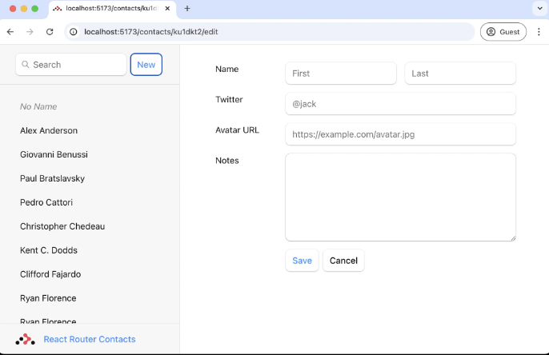
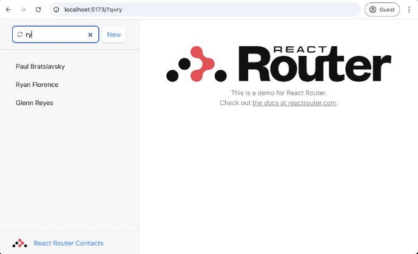
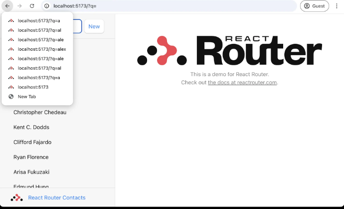
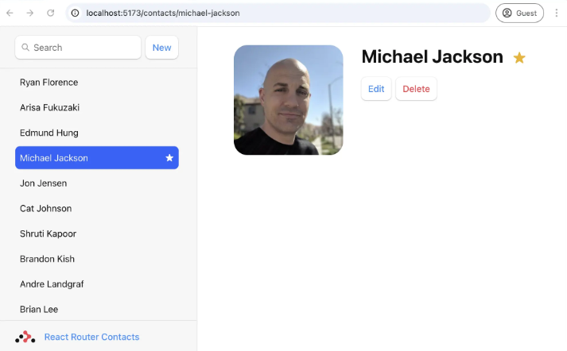

# Libreta de Direcciones

Generamos una plantilla básica:

```bash
npx create-react-router@latest --template remix-run/react-router/tutorials/address-book
```

Esto utiliza una plantilla bastante básica, pero incluye nuestro css y modelo de datos, por lo que podemos centrarnos en React Router.

### Iniciamos la aplicación

```bash
cd /ruta/a/la/app

// Instalamos las dependencias
npm install

// Inicializamos el servidor
npm run dev
```

En la ruta `app/root.tsx` contiene el diseño global de la página, es decir, la interfaz de usuario.

## La interfaz de usuario de la ruta de contacto

Si ahora hacemos clic en alguno de los elementos de la barra lateral, obtendremos la página 404 predeterminada.
Vamos a crear ima ruta que coincida con la url. `/contacts/1`

### 👉 Crear un módulo de ruta de contacto

```bash
mkdir app/routes
touch app/routes/contact.tsx
```

Podríamos poner este archivo en cualquier lugar que queramos, pero para hacer las cosas un poco más organizadas, pondremos todas nuestras rutas dentro del directorio. `app/routes`

### 👉 Configurar la ruta

Necesitamos informar a React Router sobre nuestra nueva ruta, es un fichero especial donde podemos configurar todas nuestras rutas. `routes.ts`

Agregaremos las siguientes líneas que están comentadas (pero la agregamos sin comentar).

```bash
import type { RouteConfig } from "@react-router/dev/routes";
# import { route } from "@react-router/dev/routes";

export default [
#  route("contacts/:contactId", "routes/contact.tsx"),
] satisfies RouteConfig;

```

En React Router, hace que un segmento sea dinámico. Acabamos de hacer que las siguientes URLs coincidan con el módulo de ruta `:routes/contact.tsx`

### 👉 Agregar la interfaz de usuario del componente de contacto

Es solo un montón de elementos, siéntete libre de copiar / pegar.  `app/routes/contact.tsx`

```bash
import { Form } from "react-router";

import type { ContactRecord } from "../data";

export default function Contact() {
  const contact = {
    first: "Your",
    last: "Name",
    avatar: "https://placecats.com/200/200",
    twitter: "your_handle",
    notes: "Some notes",
    favorite: true,
  };

  return (
    <div id="contact">
      <div>
        
      </div>

      <div>
        <h1>
          {contact.first || contact.last ? (
            <>
              {contact.first} {contact.last}
            </>
          ) : (
            <i>No Name</i>
          )}
          <Favorite contact={contact} />
        </h1>

        {contact.twitter ? (
          <p>
            <a
              href={`https://twitter.com/${contact.twitter}`}
            >
              {contact.twitter}
            </a>
          </p>
        ) : null}

        {contact.notes ? <p>{contact.notes}</p> : null}

        <div>
          <Form action="edit">
            <button type="submit">Edit</button>
          </Form>

          <Form
            action="destroy"
            method="post"
            onSubmit={(event) => {
              const response = confirm(
                "Please confirm you want to delete this record."
              );
              if (!response) {
                event.preventDefault();
              }
            }}
          >
            <button type="submit">Delete</button>
          </Form>
        </div>
      </div>
    </div>
  );
}

function Favorite({
  contact,
}: {
  contact: Pick<ContactRecord, "favorite">;
}) {
  const favorite = contact.favorite;

  return (
    <Form method="post">
      <button
        aria-label={
          favorite
            ? "Remove from favorites"
            : "Add to favorites"
        }
        name="favorite"
        value={favorite ? "false" : "true"}
      >
        {favorite ? "★" : "☆"}
      </button>
    </Form>
  );
}

```

## Rutas anidadas y puntos de venta

React Router admite enrutamiento anidado. Para que las rutas hijas se rendericen dentro de los diseños principales, necesitamos renderizar un `_Outlet_` en el padre. Arreglémoslo, abramos y hagamos una toma de corriente en el interior. `app/root.tsx`

### 👉 Renderizar un `_<Outlet />_`

`app/root.tsx`
```bash
 import {
  Form,
  Outlet,
  Scripts,
  ScrollRestoration,
  isRouteErrorResponse,
} from "react-router";

// existing imports & exports

export default function App() {
  return (
    <>
      <div id="sidebar">{/* other elements */}</div>
      <div id="detail">
        <Outlet />
      </div>
    </>
  );
}
```

## Enrutamiento del lado del cliente

Es posible que lo haya notado o no, pero cuenado hacemos clic en los enlaces en la barra de lateral, el navegador está realizando una solicitud de documento completo para la siguiente URL en lugar de enrutamiento del lado del cliente, lo que vuelve a montar completamente nuestra aplicación.

El enrutamiento del lado del cliente permite que nuestra aplicación actualice la URL sin tener que volver a cargar toda la página. En su lugar, la aplicación puede representar inmediatamente una nueva interfaz de usuario. Hagámoslo realidad con `_<Link>_`

### 👉 Cambia la barra lateral `<a href>` `a <Vincular a>`

`app/root.tsx`
```bash
import {
  Form,
  Link,
  Outlet,
  Scripts,
  ScrollRestoration,
  isRouteErrorResponse,
} from "react-router";

// existing imports & exports

export default function App() {
  return (
    <>
      <div id="sidebar">
        {/* other elements */}
        <nav>
          <ul>
            <li>
              <Link to={`/contacts/1`}>Your Name</Link>
            </li>
            <li>
              <Link to={`/contacts/2`}>Your Friend</Link>
            </li>
          </ul>
        </nav>
      </div>
      {/* other elements */}
    </>
  );
}

```

## Carga de datos

En la mayoría de los casos, los segmentos de URL, los diseños y los datos que se acoplan juntos. Ya lo podemos ver en esta aplicación: 

| Segmento de URL         | Componente | Datos                  |
|-------------------------|------------|-------------------------|
| `/`                     | `<App>`     | `Lista de contactos`    |
| `contactos/:contactId`  | `<Contact>` | `Contacto individual`   |

Debido a este acoplamiento natural, React Router tiene convenciones de datos para obtener datos en sus componentes de ruta fácilmente.

Primero crearemos y exportaremos una función `clientLoader` en la ruta raíz y, a continuación rederizamos los datos.

### 👉 Exportar una función clientLoader desde app/root.tsx y renderizar los datos

> [!NOTE]
> El siguiente código tiene un error de tipo, lo corregiremos en la siguiente sección.

`app/root.tsx`
```bash
// existing imports
import { getContacts } from "./data";

// existing exports

export async function clientLoader() {
  const contacts = await getContacts();
  return { contacts };
}

export default function App({ loaderData }) {
  const { contacts } = loaderData;

  return (
    <>
      <div id="sidebar">
        {/* other elements */}
        <nav>
          {contacts.length ? (
            <ul>
              {contacts.map((contact) => (
                <li key={contact.id}>
                  <Link to={`contacts/${contact.id}`}>
                    {contact.first || contact.last ? (
                      <>
                        {contact.first} {contact.last}
                      </>
                    ) : (
                      <i>No Name</i>
                    )}
                    {contact.favorite ? (
                      <span>★</span>
                    ) : null}
                  </Link>
                </li>
              ))}
            </ul>
          ) : (
            <p>
              <i>No contacts</i>
            </p>
          )}
        </nav>
      </div>
      {/* other elements */}
    </>
  );
}
```

## Tipo de seguridad 

Probablemente hayas notado que no asignamos un tipo a la propiedad. Vamos a arreglar eso. `loaderData`

### 👉 Agregue el tipo `ComponentProps` al componente `App`

```bash
// existing imports
import type { Route } from "./+types/root";
// existing imports & exports

export default function App({
  loaderData,
}: Route.ComponentProps) {
  const { contacts } = loaderData;

  // existing code
}

```

Espera, ¿qué? ¡¿De dónde vinieron estos tipos?!

No los definimos, pero de alguna manera ya saben sobre la propiedad que devolvimos de nuestro `.contactsclientLoader`

Esto se debe a que React Router genera tipos para cada ruta en su aplicación para proporcionar seguridad de tipos automática.

## Agregar un `HydrateFallback`

Mencionamos anteriormente que estamos trabajando en una aplicación de una sola página sin renderizado del lado del servidor. Si miras dentro de `react-router.config.ts` verás que esto está configurado con un booleano simple:

`react-router.config.ts`
```bash
import { type Config } from "@react-router/dev/config";

export default {
  ssr: false,
} satisfies Config;
```

### 👉 Adición de una exportación de `HydrateFallback`

Podemos proporcionar una reserva que se mostrará antes de que la aplicación se hidrate (se represente en el cliente por primera vez) con una exportación de `HydrateFallback`.

`app/root.tsx`
```bash
// existing imports & exports

export function HydrateFallback() {
  return (
    <div id="loading-splash">
      <div id="loading-splash-spinner" />
      <p>Loading, please wait...</p>
    </div>
  );
}
```

## Indice de rutas

Cuando cargue la aplicación y aún no esté en ninguna página de contacto, notará una gran página en blanco en el lado derecho de la lista.


Cuando una ruta tiene elementos secundarios y se encuentra en la ruta de acceso de la ruta principal, no tiene nada que representar porque no coinciden los elementos secundarios. Puede pensar en las rutas de índice como la ruta secundaria predeterminada para rellenar ese espacio. `<Outlet>`

### 👉 Creación de una ruta de índice para la ruta raíz

```bash
touch app/routes/home.tsx
```

`app/routes.ts`
```bash
import type { RouteConfig } from "@react-router/dev/routes";
import { index, route } from "@react-router/dev/routes";

export default [
  index("routes/home.tsx"),
  route("contacts/:contactId", "routes/contact.tsx"),
] satisfies RouteConfig;

```

### 👉 Rellene los elementos del componente de índice
Siéntase libre de copiar / pegar, nada especial aquí.

`app/routes/home.tsx`
```bash
export default function Home() {
  return (
    <p id="index-page">
      This is a demo for React Router.
      <br />
      Check out{" "}
      <a href="https://reactrouter.com">
        the docs at reactrouter.com
      </a>
      .
    </p>
  );
}
```

## Adición de la ruta Acerca de

Antes de pasar a trabajar con datos dinámicos con los que el usuario puede interactuar, agreguemos
una página con contenido estático que esperamos que rara vez cambie. Una página acerca de será perfecta para esto.

### 👉 Crear la ruta acerca de

```bash
touch app/routes/about.tsx
```
### 👉 Agregar la interfaz de usuario de la página Acerca de

No hay nada especial aquí, solo copia y pega.

`app/routes/about.tsx`
```bash
import { Link } from "react-router";

export default function About() {
  return (
    <div id="about">
      <Link to="/">← Go to demo</Link>
      <h1>About React Router Contacts</h1>

      <div>
        <p>
          This is a demo application showing off some of the
          powerful features of React Router, including
          dynamic routing, nested routes, loaders, actions,
          and more.
        </p>

        <h2>Features</h2>
        <p>
          Explore the demo to see how React Router handles:
        </p>
        <ul>
          <li>
            Data loading and mutations with loaders and
            actions
          </li>
          <li>
            Nested routing with parent/child relationships
          </li>
          <li>URL-based routing with dynamic segments</li>
          <li>Pending and optimistic UI</li>
        </ul>

        <h2>Learn More</h2>
        <p>
          Check out the official documentation at{" "}
          <a href="https://reactrouter.com">
            reactrouter.com
          </a>{" "}
          to learn more about building great web
          applications with React Router.
        </p>
      </div>
    </div>
  );
}

```

### 👉 Añade un enlace a la página "Acerca de" en la barra lateral

`app/root.tsx`
```bash
export default function App() {
  return (
    <>
      <div id="sidebar">
        <h1>
          <Link to="about">React Router Contacts</Link>
        </h1>
        {/* other elements */}
      </div>
      {/* other elements */}
    </>
  );
}
```
## Rutas de diseño

En realidad, no queremos que la página Acerca de esté anidada dentro del diseño de la barra lateral.
Vamos a mover la barra lateral a un diseño para que podamos evitar renderizarla en la página acerca de. Además,
queremos evitar cargar todos los datos de los contactos en la página acerca de.

### 👉 Crear una ruta de diseño para la barra lateral

Puede nombrar y poner esta ruta de diseño donde desee, pero ponerla dentro de un directorio ayudará a mantener las cosas organizadas 
para nuestra secilla aplicación. `layouts`

```bash
 mkdir app/layouts
 touch app/layouts/sidebar.tsx
 ```

Por ahora solo devuelve un `<Outlet>`

`app/layouts/sidebar`
```bash
import { Outlet } from "react-router";

export default function SidebarLayout() {
  return <Outlet />;
}
```

### 👉 Mover definiciones de ruta debajo del diseño de la barra lateral

Podemos definir una ruta para renderizar automáticamente la barra lateral para todas las rutas coincidentes dentro de ella.
Esto es básicamente lo que era, pero ahora podemos abarcarlo a rutas específicas. `layout` `root`

`app/routes`
```bash
import type { RouteConfig } from "@react-router/dev/routes";
import {
  index,
#  layout,
  route,
} from "@react-router/dev/routes";

export default [
#  layout("layouts/sidebar.tsx", [
    index("routes/home.tsx"),
    route("contacts/:contactId", "routes/contact.tsx"),
#  ]),
  route("about", "routes/about.tsx"),
] satisfies RouteConfig;
```
Los únicos cambios es agregar las lineas que están comentadas.

### 👉 Mover el diseño y la obtención de datos al diseño de la barra lateral

Queremos mover todo lo que hay dentro del componente al diseño de la barra lateral. Debería verse así: `clientLoader` `App`

`app/layouts/sidebar.tsx`
```bash
import { Form, Link, Outlet } from "react-router";
import { getContacts } from "../data";
import type { Route } from "./+types/sidebar";

export async function clientLoader() {
  const contacts = await getContacts();
  return { contacts };
}

export default function SidebarLayout({
  loaderData,
}: Route.ComponentProps) {
  const { contacts } = loaderData;

  return (
    <>
      <div id="sidebar">
        <h1>
          <Link to="about">React Router Contacts</Link>
        </h1>
        <div>
          <Form id="search-form" role="search">
            <input
              aria-label="Search contacts"
              id="q"
              name="q"
              placeholder="Search"
              type="search"
            />
            <div
              aria-hidden
              hidden={true}
              id="search-spinner"
            />
          </Form>
          <Form method="post">
            <button type="submit">New</button>
          </Form>
        </div>
        <nav>
          {contacts.length ? (
            <ul>
              {contacts.map((contact) => (
                <li key={contact.id}>
                  <Link to={`contacts/${contact.id}`}>
                    {contact.first || contact.last ? (
                      <>
                        {contact.first} {contact.last}
                      </>
                    ) : (
                      <i>No Name</i>
                    )}
                    {contact.favorite ? (
                      <span>★</span>
                    ) : null}
                  </Link>
                </li>
              ))}
            </ul>
          ) : (
            <p>
              <i>No contacts</i>
            </p>
          )}
        </nav>
      </div>
      <div id="detail">
        <Outlet />
      </div>
    </>
  );
}
```

Y en el interior, solo debe devolver un `<Outlet>` , y todas las importaciones no utilizadas se pueden eliminar. Asegúrese de que no haya ningún archivo `.app/root.tsx` `App` `clientLoader` `root.tsx`

`app/root.tsx`
```bash
// existing imports and exports

export default function App() {
  return <Outlet />;
}
```

## Renderizado previo de una ruta estática

Si actualiza la página Acerca de, seguirá viendo el control giratorio de carga durante una fracción de segundo antes de que la página se procese en el cliente. Esto realmente no es una buena experiencia, además de que la página es solo información estática, deberíamos poder pre-renderizarla como HTML estático en tiempo de compilación.

### 👉 Renderizar previamente la página Acerca de

Dentro de `app/react-router.config.ts` podemos agregar una matriz de `prerenderizado` a la configuración para decirle a React Router
que pre-renderice ciertas URL en tiempo de compilación. En este caso, solo queremos renderizar previamente la página acerca de. `app/react-router.config.ts`

`app/react-router.config.ts`
```bash
import { type Config } from "@react-router/dev/config";

export default {
  ssr: false,
  prerender: ["/about"],
} satisfies Config;
```

## Renderizado del lado del servidor

React Router es un gran marco para crear aplicaciones de una sola página. Muchas aplicaciones se atienden bien solo mediante la representación del lado del cliente y, tal vez, la representación previa estática de algunas páginas en tiempo de compilación.

Si alguna vez quieres introducir el renderizado del lado del servidor en tu aplicación React Router, es increíblemente fácil (¿Recuerdas el booleano de antes?) `ssr:false`

### 👉 Habilitación de la representación del lado del servidor

`app/react-router.config.ts`
```bash
export default {
  ssr: true,
  prerender: ["/about"],
} satisfies Config;
```

Y ahora... ¿Nada es diferente? ¿Todavía estamos recibiendo nuestro spinner por una fracción de segundo antes de que la página se renderice en el cliente? Además, ¿no estamos usando , por lo que nuestros datos aún se obtienen en el cliente? `clientLoader`

¡Así es! Con React Router, aún puede usar (y ) para realizar la obtención de datos del lado del cliente donde mejor le parezca. React Router le brinda mucha flexibilidad para usar la herramienta adecuada para el trabajo. `clientLoader` `clientAction`

Pasemos a usar el `cargador`, que (lo has adivinado) se utiliza para obtener datos en el servidor.

### 👉 Cambiar al uso `del cargador` para obtener datos
`app/layouts/sidebar.tsx`
```bash
// existing imports

export async function loader() {
  const contacts = await getContacts();
  return { contacts };
}
```

Si lo establece o depende de sus necesidades y las de sus usuarios. Ambas estrategias son perfectamente válidas. Durante el resto de este tutorial, vamos a usar el renderizado del lado del servidor, pero sepa que todas las estrategias de renderizado son ciudadanos de primera clase en React Router. `ssr: true` o `ssr: false`

## Parámetros de URL en cargadores

### 👉 Haga clic en uno de los enlaces de la barra lateral

Deberíamos volver a ver nuestra antigua página de contacto estática, con una diferencia: la URL ahora tiene un ID real para el registro.


¿Recuerdas la parte de la definición de la ruta? Estos segmentos dinámicos coincidirán con los valores dinámicos (cambiantes) en esa posición de la URL. A estos valores en la URL los llamamos "Parámetros de URL" o, simplemente, "parámetros". `:contactId` en `app/routes.ts`

Estos se pasan al cargador con claves que coinciden con el segmento dinámico. Por ejemplo, nuestro segmento tiene un nombre, por lo que el valor se pasará como
`params` `:contactId` `params.contactId`

>[!NOTE]
> El siguiente código tiene errores de tipo, los corregiremos en la siguiente sección

`app/routes/contact.tsx`
```bash
// existing imports
import { getContact } from "../data";
import type { Route } from "./+types/contact";

export async function loader({ params }: Route.LoaderArgs) {
  const contact = await getContact(params.contactId);
  return { contact };
}

export default function Contact({
  loaderData,
}: Route.ComponentProps) {
  const { contact } = loaderData;

  // existing code
}

// existing code
```


## Respuestas de lanzamiento

Te darás cuenta de que el tipo es en función de nuestra seguridad de tipos automática, TypeScript ya sabe que es una cadena, pero no hemos hecho nada para asegurarnos de que sea un identificador válido. Dado que es posible que el contacto no exista, podría devolver, por lo que tenemos errores de tipo. `loaderData.contact` `ContactRecord | null` `params.contactId` `getContact` `null`

Podríamos tener en cuenta la posibilidad de que el contacto no se encuentre en el código del componente, pero lo que hay que hacer es enviar un 404 adecuado. Podemos hacer eso en el loader o cargador y resolver todos nuestros problemas a la vez.

`app/routes/contact.tsx`
```bash
// existing imports

export async function loader({ params }: Route.LoaderArgs) {
  const contact = await getContact(params.contactId);
  if (!contact) {
    throw new Response("Not Found", { status: 404 });
  }
  return { contact };
}

// existing code
```

Ahora, si no se encuentra al usuario, la ejecución del código en esta ruta se detiene y React Router representa la ruta del error en su lugar. Los componentes de React Router solo pueden centrarse en la ruta feliz😁 

## Mutaciones de datos

Crearemos nuestro primer contacto en un segundo, pero primero hablemos de HTML.

React Router emula la navegación de formularios HTML como la primitiva de mutación de datos, que solía ser la única forma antes de la explosión cámbrica de JavaScript. ¡No te dejes engañar por la simplicidad! Los formularios en React Router le brindan las capacidades de UX de las aplicaciones renderizadas por el cliente con la simplicidad del modelo web de la "vieja escuela".

Si bien no son familiares para algunos desarrolladores web, los HTML en realidad causan una navegación en el navegador, al igual que hacer clic en un enlace. La única diferencia está en la solicitud: los enlaces solo pueden cambiar la URL, mientras que también pueden cambiar el método de solicitud (vs.) y el cuerpo de la solicitud (datos del formulario). `form` `GET` `POST`

Sin el enrutamiento del lado del cliente, el navegador serializará los datos automáticamente y los enviará al servidor como el cuerpo (body) de la solicitud para y como `URLSearchParams` para React ROuter hace lo mismo, excepto que en lugar de enviar la solicitud al servidor, utiliza el enrutamiento del lado del cliente y la envía a la función de `action`. `form` `POST` `GET`

Podemos probar esto haciendo clic en el botón "Nuevo" en nuestra aplicación.


React Router envía un 405 porque no hay código en el servidor para manejar este formulario de navegación.

## Creación de contactos

Crearemos nuevos contactos exportando una función en nuestra ruta raíz. Cuando el usuario hace clic en el botón "Nuevo", el formulario pasará a la acción de ruta raíz. `action` `POST`

## 👉 Exportar una función de `action` desde `app/root.tsx`

`app/root.tsx`
```bash
// existing imports

import { createEmptyContact } from "./data";

export async function action() {
  const contact = await createEmptyContact();
  return { contact };
}

// existing code
```


El método simplemente crea un contacto vacío sin nombre ni datos ni nada. Pero aún así crea un récord, ¡lo prometo! `createEmptyContact`

> 🧐 Espera un segundo... ¿Cómo se actualizó la barra lateral? 
> ¿Dónde llamamos a la función? 
> ¿Dónde está el código para volver a recuperar los datos? ¿Dónde están?
> `action` `useState` `onSubmit` `useEffect`

Aquí es donde aparece el modelo de programación de la "web de la vieja escuela". `<Form>` evita que el navegador envíe la solicitud al servidor y la envía a la función de su ruta en su lugar con `fetch`. `action`

En semántica web, generalmente significa que algunos datos están cambiando. Por convención, React Router usa esto como una sugerencia para revalidar automáticamente los datos en la página después de que finalice. `POST` `action`

De hecho, dado que todo es solo HTML y HTTP, puede deshabilitar JavaScript y todo seguirá funcionando. En lugar de que React Router serialice el formulario y realice una solicitud de `fetch` o `recuperación` a su servidor, el navegador serializará el formulario y realizará una solicitud de documento. A partir de ahí, React Router renderizará el lado del servidor de la página y lo enviará. Al final, es la misma interfaz de usuario de cualquier manera.

Sin embargo, mantendremos JavaScript porque vamos a crear una mejor experiencia de usuario que los favicons giratorios y los documentos estáticos.

## Actualización de datos

Agreguemos una forma de completar la información para nuestro nuevo registro.

Al igual que la creación de datos, los actualiza con `<Form>`. Vamos hacer un nuevo módulo de ruta dentro de `app/routes/edit-contact.tsx`

### 👉 Crear la ruta de edición de contacto

```bash
touch app/routes/edit-contact.tsx
```
No olvide agregar la ruta a : `app/routes.ts`

`app/routes.ts`
```bash
export default [
  layout("layouts/sidebar.tsx", [
    index("routes/home.tsx"),
    route("contacts/:contactId", "routes/contact.tsx"),
    route(
      "contacts/:contactId/edit",
      "routes/edit-contact.tsx"
    ),
  ]),
  route("about", "routes/about.tsx"),
] satisfies RouteConfig;
```
### 👉 Agregar la interfaz de usuario de la página de edición

Nada que no hayamos visto antes, siéntete libre de copiar/pegar:

`app/routes/edit-contact.tsx`
```bash
import { Form } from "react-router";
import type { Route } from "./+types/edit-contact";

import { getContact } from "../data";

export async function loader({ params }: Route.LoaderArgs) {
  const contact = await getContact(params.contactId);
  if (!contact) {
    throw new Response("Not Found", { status: 404 });
  }
  return { contact };
}

export default function EditContact({
  loaderData,
}: Route.ComponentProps) {
  const { contact } = loaderData;

  return (
    <Form key={contact.id} id="contact-form" method="post">
      <p>
        <span>Name</span>
        <input
          aria-label="First name"
          defaultValue={contact.first}
          name="first"
          placeholder="First"
          type="text"
        />
        <input
          aria-label="Last name"
          defaultValue={contact.last}
          name="last"
          placeholder="Last"
          type="text"
        />
      </p>
      <label>
        <span>Twitter</span>
        <input
          defaultValue={contact.twitter}
          name="twitter"
          placeholder="@jack"
          type="text"
        />
      </label>
      <label>
        <span>Avatar URL</span>
        <input
          aria-label="Avatar URL"
          defaultValue={contact.avatar}
          name="avatar"
          placeholder="https://example.com/avatar.jpg"
          type="text"
        />
      </label>
      <label>
        <span>Notes</span>
        <textarea
          defaultValue={contact.notes}
          name="notes"
          rows={6}
        />
      </label>
      <p>
        <button type="submit">Save</button>
        <button type="button">Cancel</button>
      </p>
    </Form>
  );
}
```

Ahora haga clic en su nuevo registro, luego haga clic en el botón "Editar". Deberíamos ver la nueva ruta.


## Actualización de contactos con FormData

La ruta de edición que acabamos de crear ya representa un archivo . Todo lo que tenemos que hacer es añadir la función. React Router serializará el , it con `fetch` y revalidará automáticamente todos los datos. `form` `action` `form` `POST`

### 👉 Agregar una función de `action` a la ruta de edición

`app/routes/edit-contact.tsx`
```bash
import { Form, redirect } from "react-router";
// existing imports

import { getContact, updateContact } from "../data";

export async function action({
  params,
  request,
}: Route.ActionArgs) {
  const formData = await request.formData();
  const updates = Object.fromEntries(formData);
  await updateContact(params.contactId, updates);
  return redirect(`/contacts/${params.contactId}`);
}

// existing code
```

## Discusión sobre la mutación
> 😑 Funcionó, pero no tengo ni idea de lo que está pasando aquí...

Profundicemos un poco...

Ábrete y mira los elementos. Fíjate en que cada uno de ellos tiene un nombre: `app/routes/edit-contacts.tsx` `form`

`app/routes/edit-contacts.tsx`
```bash
<input
  aria-label="First name"
  defaultValue={contact.first}
# name="first"
  placeholder="First"
  type="text"
/>
```

Sin JavaScript, cuando se envía un formulario, el navegador creará `FormData` y lo establecerá como el cuerpo de la solicitud cuando la envíe al servidor. Como se mencionó anteriormente, React Router evita eso y emula el navegador enviando la solicitud a su función con `fetch` en su lugar, incluuido el `FormData`. `action`

Se puede acceder a cada campo de la carpeta. Por ejemplo, dado el campo de entrada de arriba, podría acceder al nombre y apellido de la siguiente manera: `form` `formData.get(name)`

`app/routes/edit-contact.tsx`
```bash
export const action = async ({
  params,
  request,
}: ActionFunctionArgs) => {
  const formData = await request.formData();
# const firstName = formData.get("first");
# const lastName = formData.get("last");
  // ...
};
```
Dado que tenemos un puñado de campos de formulario, usamos `Object.fromEntries` para recopilarlos todos en un objeto, que es exactamente lo que quiere nuestra función. `updateContact`

`app/routes/edit-contact.tsx`
```bash
const updates = Object.fromEntries(formData);
updates.first; // "Some"
updates.last; // "Name"
```

Aparte de la función, ninguna de estas API que estamos discutiendo es proporcionada por React Router: `request`, `request.formData`, `Object.fromEntries` son todas proporcionadas por la plataforma web. `action`

Después de que terminemos, observe la redirección al final: `action`

`app/routes/edit-contact.tsx`
```bash
export async function action({
  params,
  request,
}: Route.ActionArgs) {
  invariant(params.contactId, "Missing contactId param");
  const formData = await request.formData();
  const updates = Object.fromEntries(formData);
  await updateContact(params.contactId, updates);
  return redirect(`/contacts/${params.contactId}`);
}
```

Tanto el `action` como las funciones pueden devolver un (tiene sentido, ya que recibieron una `request`). El asistente de `redireccionamiento` o `redirect` solo facilita la devolución de una `respuesta` o `response` que le dice a la aplicación que cambie su ubicación. `loader` `Response`

Sin el enrutamiento del lado del cliente, si un servidor se refirige después de una solicitud, la nueva página obtendría los datos más recientes y se renderizaría. Como aprendimos antes, React Router emula este modelo y revalida automáticamente los datos en la página después de la llamada. Es por eso que la barra lateral se actualiza automáticamente cuando guardamos el formulario. El código de revalidación adicional no existe sin el enrutamiento del lado del cliente, por lo que tampoco es necesario que exista con el enrutamiento del lado del cliente en React Router. `POST` `action`

Una última cosa. Sin JavaScript, la redirección sería una redirección normal. Sin embargo, con JavaScript es una redirección del lado del cliente, por lo que el usuario no pierde el estado del cliente, como las posiciones de desplazamiento o el estado del componente.

## Redireccionamiento de nuevos registros a la página de edición

Ahora que sabemos como redirigir, actualicemos la acción que crea nuevos contactos para redirigir a la página de edición:

### 👉 Redirigir a la página de edición del nuevo registro

`app/root.tsx`
```bash
import {
  Outlet,
  Scripts,
  ScrollRestoration,
  isRouteErrorResponse,
#  redirect,
} from "react-router";
// existing imports

export async function action() {
  const contact = await createEmptyContact();
#  return redirect(`/contacts/${contact.id}/edit`);
}

// existing code

```

Ahora, cuando hacemos clic en "Nuevo", deberíamos terminar en la página de edición:



## Estilo de enlace activo

Ahora que tenemos un montón de registros, no está claro cuál estamos viendo en la barra lateral.
Podemos usar `NavLink` para solucionar esto.

### 👉 Reemplace `<Link>` por `<NavLink>` en la barra lateral

`app/layouts/sidebar.tsx`
```bash
import { Form, Link, NavLink, Outlet } from "react-router";

// existing imports and exports

export default function SidebarLayout({
  loaderData,
}: Route.ComponentProps) {
  const { contacts } = loaderData;

  return (
    <>
      <div id="sidebar">
        {/* existing elements */}
        <ul>
          {contacts.map((contact) => (
            <li key={contact.id}>
              <NavLink
                className={({ isActive, isPending }) =>
                  isActive
                    ? "active"
                    : isPending
                    ? "pending"
                    : ""
                }
                to={`contacts/${contact.id}`}
              >
                {/* existing elements */}
              </NavLink>
            </li>
          ))}
        </ul>
        {/* existing elements */}
      </div>
      {/* existing elements */}
    </>
  );
}
```

Tenga en cuenta que estamos pasando una función cuando el usuario está en la URL que coincide, entonces será verdadero. Cuando esté a punto de estar activo (los datos aún se están cargando), entonces será verdadero. Esto nos permite indicar fácilmente donde está el usuario y también proporcionar información inmediata cuando se hace clic en los enlaces pero es necesario cargar los datos. `className` `<NavLink to>` `isActive` `isPending`


## Interfaz de usuario pendiente global

A medida que el usuario navega por la aplicación, React Router dejará la página anterior a medida que se cargan los datos para la página siguiente. Es posible que haya notado que la aplicación no responde un poco al hacer clic entre la lista. Proporcionemos al usuario algunos comentarios para que la aplicación no se sienta que no responde.

React Router administra todo el estado detrás de escena y revela las piezas que necesita para crear aplicaciones web dinámicas. En este caso, usaremos el gancho `useNavigation`.

### Use `useNavigation` para agregar una interfaz de usuario pendiente global

`app/layouts/sidebar.tsx`
```bash
import {
  Form,
  Link,
  NavLink,
  Outlet,
#  useNavigation,
} from "react-router";

export default function SidebarLayout({
  loaderData,
}: Route.ComponentProps) {
  const { contacts } = loaderData;
#  const navigation = useNavigation();

  return (
    <>
      {/* existing elements */}
      <div
    #    className={
    #      navigation.state === "loading" ? "loading" : ""
    #    }
        id="detail"
      >
        <Outlet />
      </div>
    </>
  );
}

```

`useNavigation` devuelve el estado de navegación actual: puede ser uno de `"idle"` `"loading"` `"submitting"`

En nuestro caso, añadimos una clase a la parte principal de la aplicación si no estamos inactivos. Luego, el CSS agrega un agradable desvanecimiento después de un breve retraso (para evitar parpadear la interfaz de usuario para cargas rápidas). Sin embargo, puedes hacer lo que quieras, como mostrar un girador o una barra de carga en la parte superior. `"loading"`


## Eliminación de registros

Si revisamos el código en la ruta de contacto, podemos encontrar que el botón de eliminar se ve así

`app/routes/contact.tsx`
```bash
<Form
  action="destroy"
  method="post"
  onSubmit={(event) => {
    const response = confirm(
      "Please confirm you want to delete this record."
    );
    if (!response) {
      event.preventDefault();
    }
  }}
>
  <button type="submit">Delete</button>
</Form>
```

Tenga en cuenta los puntos, al igual que, puede tomar un valor relativo. Dado que el formulario se representa en la ruta, una acción relativa enviará el formulario cuando se haga clic. `action` `"destroy"` `<Lint to>` `<Form action>` `contacts/:contactId` `destroy` `contacts/:contactId/destroy`

En este punto, debe saber todo lo que necesita saber para que el botón Eliminar funcione. ¿Tal vez intentarlo antes de seguir adelante? Necesitarás:

1. Una nueva ruta.
2. Y en esa ruta `action`.
3. `deleteCOntact` de `app/data.ts`
4. `redirect` a algún lugar después

### 👉 Configurar el módulo de ruta "destroy"

```bash
touch app/routes/destroy-contact.tsx
```

`app/routes.ts`
```bash
export default [
  // existing routes
  route(
    "contacts/:contactId/destroy",
    "routes/destroy-contact.tsx"
  ),
  // existing routes
] satisfies RouteConfig;
```

### 👉 Agregar la acción de destrucción

`app/routes/destroy-contact.tsx`
```bash
import { redirect } from "react-router";
import type { Route } from "./+types/destroy-contact";

import { deleteContact } from "../data";

export async function action({ params }: Route.ActionArgs) {
  await deleteContact(params.contactId);
  return redirect("/");
}
```
Muy bien, navegue hasta un registro y haga clic en el botón "Eliminar". ¡Funciona!

> 😅 Todavía estoy confundido por qué todo esto funciona

Cuando el usuario hace clic en el botón Enviar:

1. `<Form>` Evita el comportamiento predeterminado del navegador de enviar una nueva solicitud de documento al servidor, pero en su lugar emula el navegador mediante la creación de una solicitud con enrutamiento y `recuperación` o `fetch` del lado del cliente `POST`

2. Coincide con la nueva ruta y le envía la solicitud `<Form action="destroy">` `contacts/:contactId/destroy`

3. Después de las redirecciones, React Router llama a todos los datos de la página para obtener los valores más recientes (esto es "revalidación"). ¡Ahora tiene nuevos valores y hace que los componentes se actualizcen! `action` `loader` `loaderData` `routes/contact.tsx`

Agregue un `Form` `action`, React Router hace el resto.

## Botón Cancelar

En la página de edición tenermos un botón de cancelar que aún no hace nada. Nos gustaría que hiciera lo mismo que el botón de retroceso del navegador.

Necesitaremos un controlador de clics en el botón, así como `useNavigate`.

### 👉 Agregue el controlador de clic del botón "Cancelar" con `useNavigate`

`app/routes/edit-contact.tsx`
```bash
import { Form, redirect, useNavigate } from "react-router";
// existing imports & exports

export default function EditContact({
  loaderData,
}: Route.ComponentProps) {
  const { contact } = loaderData;
  const navigate = useNavigate();

  return (
    <Form key={contact.id} id="contact-form" method="post">
      {/* existing elements */}
      <p>
        <button type="submit">Save</button>
        <button onClick={() => navigate(-1)} type="button">
          Cancel
        </button>
      </p>
    </Form>
  );
}
```

Ahora, cuando el usuario haga clic en "Cancelar", se le devolverá una entrada en el historial del navegador.

> 🧐 ¿Por qué no hay en el botón? `event.preventDefault()`

Aunque parezca redundante, es la forma HTML de evitar que un botón envíe su formulario. `<button type="button">`

Dos características más para ir. ¡Estamos en la recta final!

## `URLSearchParams` y Presentaciones `GET`

Hasta ahora, toda nuestra interfaz de usuario interactiva ha sido enlaces que cambian la URL o que publican datos en funciones. El campo de búsqieda es interesante porque es una mezcla de ambos: pero solo cambia la URL, no cambian los datos. `form` `action` `form`

Veamos qué sucede cuando enviamos el formulario de búsqueda:

### 👉 Escriba un nombre en el campo de búsqueda y presione la tecla Intro

Tenga en cuenta que la URL del navegador ahora contiene su consulta en la URL como `URLSearchParams`:

`http://localhost:5173/?q=ryan`

Dado que no es, React Router emula el navegador serializando `FormData` en `URLSearchParams` en lugar del cuerpo de la solicitud. `<Form method="post">`

`loader` Las funciones tienen acceso a los parámetros de búsqueda desde el archivo. Vamos a usarlo para filtrar la lista: `request`

### 👉 Filtrar la lista si hay `URLSearchParams`

`app/layouts/sidebar`
```bash
// existing imports & exports

export async function loader({
  request,
}: Route.LoaderArgs) {
  const url = new URL(request.url);
  const q = url.searchParams.get("q");
  const contacts = await getContacts(q);
  return { contacts };
}

// existing code
```

Debido a que se trata de un , no un , React Router no llama a la función. Enviar un es lo mismo que hacer clic en un enlace: solo cambia la URL. `GET` `POST` `action` `GET` `form`

Esto también significa que es una navegación normal por la página. Puedes hacer clic en el botón Atrás para volver a donde estabas.

## Sincronización de direcciones URL con el estado del formulario

Aquí hay un par de problemas de UX de los que podemos ocuparnos rápidamente.

1. Si vuelve a hacer clic después de una búsqueda, el campo del formulario seguirá teniendo el valor que ha introducido, aunque la lista ya no esté filtrada.

2. Si actualiza la página después de realizar la búsqueda, el campo del formulario ya no tiene el valor, aunque la lista esté filtrada

En otras palabras, la URL y el estado de nuestra entrada no están sincronizados.

Resolvamos (2) primero y comencemos la entrada con el valor de la URL.

### 👉 Devuelve `q` desde tu `cargador` o `loader`, establécelo como el valor predeterminado de la entrada

`app/layouts/sidebar.tsx`
```bash
// existing imports & exports

export async function loader({
  request,
}: Route.LoaderArgs) {
  const url = new URL(request.url);
  const q = url.searchParams.get("q");
  const contacts = await getContacts(q);
  return { contacts, q };
}

export default function SidebarLayout({
  loaderData,
}: Route.ComponentProps) {
  const { contacts, q } = loaderData;
  const navigation = useNavigation();

  return (
    <>
      <div id="sidebar">
        {/* existing elements */}
        <div>
          <Form id="search-form" role="search">
            <input
              aria-label="Search contacts"
              defaultValue={q || ""}
              id="q"
              name="q"
              placeholder="Search"
              type="search"
            />
            {/* existing elements */}
          </Form>
          {/* existing elements */}
        </div>
        {/* existing elements */}
      </div>
      {/* existing elements */}
    </>
  );
}
```

El campo de entrada mostrará la consulta si actualiza la página después de una búsqueda ahora.

Ahora para el problema (1), haga clic en el botón Atrás y actualice la entrada. Podemos traer desde React para manipular el valor de la entrada en el DOM directamente. `useEffect`

### 👉 Sincronizar el valor de entrada con `URLSearchParams`

`app/layouts/sidebar.tsx`
```bash
// existing imports
import { useEffect } from "react";

// existing imports & exports

export default function SidebarLayout({
  loaderData,
}: Route.ComponentProps) {
  const { contacts, q } = loaderData;
  const navigation = useNavigation();

  useEffect(() => {
    const searchField = document.getElementById("q");
    if (searchField instanceof HTMLInputElement) {
      searchField.value = q || "";
    }
  }, [q]);

  // existing code
}
```

### 🤔 ¿No deberías usar un componente controlado y React State para esto?

Ciertamente, podría hacer esto como un componente controlado. Tendrás más puntos de sincronización, pero tú decides.

## Envío de `Form` `onChange`

Aquí tenemos que tomar una decisión sobre el producto. A veces desea que el usuario envíe el para filtrar algunos resultados, otras veces desea filtrar a medida que el usuario escribe. Ya hemos implementado el primero, así que veamos cómo es el segundo. `form`

Ya hemos visto, usaremos su primo,  `useSubmit`, para esto. `useNavigate`

`app/layouts/sidebar.tsx`
```bash
import {
  Form,
  Link,
  NavLink,
  Outlet,
  useNavigation,
  useSubmit,
} from "react-router";
// existing imports & exports

export default function SidebarLayout({
  loaderData,
}: Route.ComponentProps) {
  const { contacts, q } = loaderData;
  const navigation = useNavigation();
  const submit = useSubmit();

  // existing code

  return (
    <>
      <div id="sidebar">
        {/* existing elements */}
        <div>
          <Form
            id="search-form"
            onChange={(event) =>
              submit(event.currentTarget)
            }
            role="search"
          >
            {/* existing elements */}
          </Form>
          {/* existing elements */}
        </div>
        {/* existing elements */}
      </div>
      {/* existing elements */}
    </>
  );
}
```

A medida que escribe, ¡ahora se envía automáticamente! `form`

Anote el argumento que se va a presentar o `submit`. La función serializará y enviará cualquier formulario que le pases. Estamos de paso. El es el nodo DOM al que se adjunta el evento. `submit` `event.currentTarget` `currentTarget` `form`

## Adición de un control giratorio de búsqueda

En una aplicación de producción, es probable que esta búsqueda busque registros en una base de datos que sea demasiado grande para enviarlos todos a la vez y filtrar el lado del cliente. Es por eso que esta demostración tiene una latencia de red falsa.

Sin ningún indicador de carga, la búsqueda se siente un poco lenta. Incluso si pudiéramos hacer que nuestra base de datos fuera más rápida, siempre tendremos la latencia de red del usuario en el camino y fuera de nuestro control.

Para una mejor experiencia de usuario, agreguemos algunos comentarios inmediatos sobre la interfaz de usuario para la búsqueda. Volveremos a usar `useNavigation`

### 👉 Agrega una variable para saber si estamos buscando

`app/layouts/sidebar.tsx`
```bash
// existing imports & exports

export default function SidebarLayout({
  loaderData,
}: Route.ComponentProps) {
  const { contacts, q } = loaderData;
  const navigation = useNavigation();
  const submit = useSubmit();
  const searching =
    navigation.location &&
    new URLSearchParams(navigation.location.search).has(
      "q"
    );

  // existing code
}
```
Cuando no ocurra nada, será , pero cuando el usuario navegue, se rellenará con la siguiente ubicación mientras se cargan los datos. A continuación, comprobamos si están buscando con. `navigation.location` `undefined` `location.search`

### 👉 Agregar clases a los elementos del formulario de búsqueda mediante el nuevo estado de `searching` 

`app/layouts/sidebar.tsx`
```bash
// existing imports & exports

export default function SidebarLayout({
  loaderData,
}: Route.ComponentProps) {
  // existing code

  return (
    <>
      <div id="sidebar">
        {/* existing elements */}
        <div>
          <Form
            id="search-form"
            onChange={(event) =>
              submit(event.currentTarget)
            }
            role="search"
          >
            <input
              aria-label="Search contacts"
              className={searching ? "loading" : ""}
              defaultValue={q || ""}
              id="q"
              name="q"
              placeholder="Search"
              type="search"
            />
            <div
              aria-hidden
              hidden={!searching}
              id="search-spinner"
            />
          </Form>
          {/* existing elements */}
        </div>
        {/* existing elements */}
      </div>
      {/* existing elements */}
    </>
  );
}
```

Puntos extra, evite desvanecer la pantalla principal al buscar:

`app/layouts/sidebar.tsx`
```bash
// existing imports & exports

export default function SidebarLayout({
  loaderData,
}: Route.ComponentProps) {
  // existing code

  return (
    <>
      {/* existing elements */}
      <div
        className={
          navigation.state === "loading" && !searching
            ? "loading"
            : ""
        }
        id="detail"
      >
        <Outlet />
      </div>
      {/* existing elements */}
    </>
  );
}
```

Ahora debería tener un bonito control giratorio en el lado izquierdo de la entrada de búsqueda.



## Administración de la pila de historial

Dado que el formulario se envía para cada pulsación de tecla, escribir los caracteres "alex" y luego eliminarlos con retroceso da como resultado una enorme pila de historial 😂. Definitivamente no queremos esto:



Podemos evitar esto reemplazando la entrada actual en la pila de historial con la página siguiente, en lugar de empujar hacia ella.

### 👉 Usar `replace` en `submit`

`app/layouts/sidebar.tsx`
```bash
// existing imports & exports

export default function SidebarLayout({
  loaderData,
}: Route.ComponentProps) {
  // existing code

  return (
    <>
      <div id="sidebar">
        {/* existing elements */}
        <div>
          <Form
            id="search-form"
            onChange={(event) => {
              const isFirstSearch = q === null;
              submit(event.currentTarget, {
                replace: !isFirstSearch,
              });
            }}
            role="search"
          >
            {/* existing elements */}
          </Form>
          {/* existing elements */}
        </div>
        {/* existing elements */}
      </div>
      {/* existing elements */}
    </>
  );
}
```
Después de una verificación rápida si esta es la primera búsqueda o no, decidimos reemplazar. Ahora, la primera búsqueda agregará una nueva entrada, pero cada pulsación de tecla después de eso reemplazará la entrada actual. En lugar de hacer clic 7 veces para eliminar la búsqueda, los usuarios solo tienen que hacer clic una vez.

## `Form` Sin navegación

Hasta ahora, todos nuestros formularios han cambiado la URL. Si bien estos flujos de usuario son comunes, es igualmente común querer enviar un formulario sin provocar una navegación.

Para estos casos, tenemos `useFetcher`. Nos permite comunicarnos con el servidor sin provocar una navegación. `action` `loader`

El ★ botón de la página de contacto tiene sentido para esto. No estamos creando ni eliminando un nuevo registro, y no queremos cambiar de página. Simplemente queremos cambiar los datos de la página que estamos viendo.

### 👉 Cambiar el formulario `<Favorite>` a un formulario de recuperación

`app/routes/contact.tsx`
```bash
import { Form, useFetcher } from "react-router";

// existing imports & exports

function Favorite({
  contact,
}: {
  contact: Pick<ContactRecord, "favorite">;
}) {
  const fetcher = useFetcher();
  const favorite = contact.favorite;

  return (
    <fetcher.Form method="post">
      <button
        aria-label={
          favorite
            ? "Remove from favorites"
            : "Add to favorites"
        }
        name="favorite"
        value={favorite ? "false" : "true"}
      >
        {favorite ? "★" : "☆"}
      </button>
    </fetcher.Form>
  );
}
```

Este formulario ya no provocará una navegación, sino que simplemente obtendrá el archivo . Hablando de eso... Esto no funcionará hasta que creemos el archivo . `action` `action`

### 👉 Crear el `action`

`app/routes/contact.tsx`
```bash
// existing imports
import { getContact, updateContact } from "../data";
// existing imports

export async function action({
  params,
  request,
}: Route.ActionArgs) {
  const formData = await request.formData();
  return updateContact(params.contactId, {
    favorite: formData.get("favorite") === "true",
  });
}

// existing code
```

Muy bien, ¡estamos listos para hacer clic en la estrella junto al nombre del usuario!



Compruébalo, ambas estrellas se actualizan automáticamente. Nuestro nuevo funciona casi exactamente igual que el que hemos estado usando: llama a la acción y luego todos los datos se revalidan automáticamente, incluso sus errores se detectarán de la misma manera. `<fetcher.Form method="post">` `<Form>`

Sin embargo, hay una diferencia clave, no es una navegación, por lo que la URL no cambia y la pila del historial no se ve afectada.

## Interfaz de usuario optimista

Probablemente hayas notado que la aplicación no respondía cuando hicimos clic en el botón de favoritos de la última sección. Una vez más, agregamos algo de latencia de red porque la vas a tener en el mundo real.

Para dar al usuario algo de retroalimentación, podríamos poner la estrella en un estado de carga con (muy parecido al de antes), pero esta vez podemos hacer algo aún mejor. Podemos usar una estrategia llamada "Interfaz de usuario optimista". `fetcher.state` `navigation.state`

El recuperador conoce el `FormData` que se envía, por lo que está disponible para usted en . Lo usaremos para actualizar inmediatamente el estado de la estrella, aunque la red no haya terminado. Si finalmente se produce un error en la actualización, la interfaz de usuario volverá a los datos reales. `action` `fetcher.formData`

### 👉 Leer el valor optimista de `fetcher.formData`

`app/routes/contact.tsx`
```bash
// existing code

function Favorite({
  contact,
}: {
  contact: Pick<ContactRecord, "favorite">;
}) {
  const fetcher = useFetcher();
  const favorite = fetcher.formData
    ? fetcher.formData.get("favorite") === "true"
    : contact.favorite;

  return (
    <fetcher.Form method="post">
      <button
        aria-label={
          favorite
            ? "Remove from favorites"
            : "Add to favorites"
        }
        name="favorite"
        value={favorite ? "false" : "true"}
      >
        {favorite ? "★" : "☆"}
      </button>
    </fetcher.Form>
  );
}
```
Ahora la estrella cambia inmediatamente al nuevo estado cuando haces clic en ella.

Eso es todo! Gracias por darle una oportunidad a React Router. Esperamos que este tutorial te brinde un comienzo sólido para crear excelentes experiencias de usuario. Hay mucho más que puedes hacer, así que asegúrate de consultar todas las API 😀